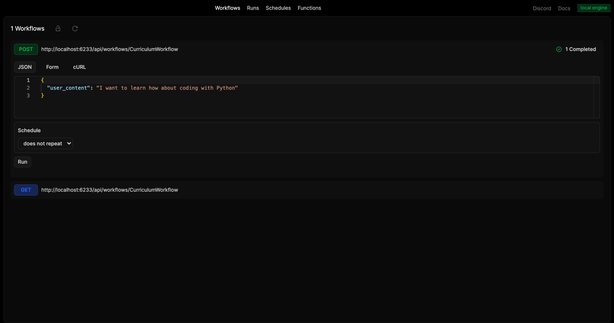

# Restack x Weaviate - Curriculum Agentic RAG

## RB Test

This repository contains a quickstart for Restack and Weaviate.
It demonstrates how to set up a basic workflow and functions with RAG integrated directly into the workflow.

## Prerequisites

- Docker (for running Restack)
- Python 3.10 < 3.13
- Google AI Studio API key (You can get a temporary one during the workshop)
- Weaviate Cloud API key (Provided during the workshop)

Helpful Docs:

- [Restack Docs](https://docs.restackio)
- [Weaviate Docs](https://weaviate.io/)
- [Google Gen AI SDK](https://googleapis.github.io/python-genai/)
- [Google Gen AI Docs](https://ai.google.dev/gemini-api/docs/sdks)

## Start Restack

To start the Restack, use the following Docker command:

```bash
docker run -d --pull always --name restack -p 5233:5233 -p 6233:6233 -p 7233:7233 ghcr.io/restackio/restack:main
```

## Install dependencies and start services

```bash
poetry env use 3.10
```

```bash
poetry shell
```

```bash
poetry install
```

```bash
poetry env info # Optional: copy the interpreter path to use in your IDE (e.g. Cursor, VSCode, etc.)
```

```bash
poetry run dev
```

## Run workflows

### from UI

You can run workflows from the UI by clicking the "Run" button.



### from API

You can run workflows from the API by using the generated endpoint:

`POST http://localhost:6233/api/workflows/CurriculumWorkflow`

## Deploy on Restack Cloud

To deploy the application on Restack, you can create an account at [https://console.restack.io](https://console.restack.io)


## Run your own Weaviate Cluster!

To run your own Weaviate Cluster, you can create a free account at [https://console.weaviate.io](https://console.weaviate.io)